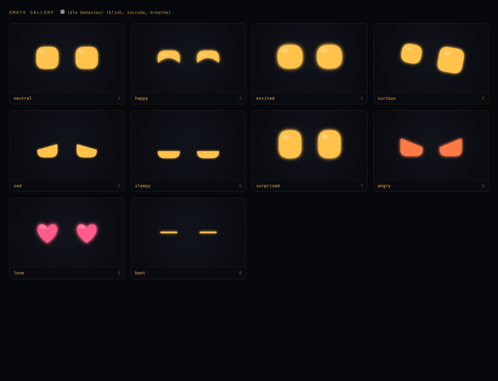

# HARE

**H**ands-on **A**daptive **R**eal-world **E**ducation.

A robot companion that runs short physical learning games. It checks a real
answer with a camera, and it changes the activity when a learner stalls.

Built with ADHD learners in mind. **It does not diagnose anything.**

---

## The problem

Some learners struggle with long, seated lessons. A fixed lesson keeps going
even when the learner needs help, a different challenge, or a break.

Screen-based tutors do not help here. They ask a learner who already finds
sitting still hard to sit still and tap a screen.

## The solution

HARE runs short physical missions with real objects on a mat. A camera checks
the answer. When a learner stalls, HARE does not push on — it changes the shape
of the lesson. Blocks become hops.

HARE **asks** the learner what they need. It offers a hint, more time, or a
movement mission. It never scores attention.

That last point is the design rule. Looking away or moving does not reliably
tell you whether someone is paying attention. So HARE does not guess. It asks.

## Where the AI fits

| Part | What it does |
|---|---|
| Computer vision | Counts blocks and recognises objects on the mat |
| Speech recognition | Hears answers and requests such as "I want a break" |
| LLM | Writes simple instructions and explains mistakes |
| Adaptive logic | Offers a hint, changes difficulty, or swaps to a movement mission |

## Why a hare, and not a dog

This is a real design decision, not decoration.

**The PARO principle.** PARO is a therapy robot shaped like a baby harp seal,
used in care settings. Its designer chose a seal deliberately. People know how a
real dog behaves, so a robot dog gets compared to a real dog and loses. Nobody
has strong expectations of how a seal behaves, so people accept whatever the
robot does.

The same applies here. A robot dog invites a comparison it cannot win. Few
people have firm expectations of a hare.

Three more reasons:

1. **Fear.** Dog fear is common in young children. Rabbit fear is rare. You will
   demo to strangers' children.
2. **Ears.** Long ears are the cheapest and clearest emotion display available,
   and they read from across a room.
3. **Four legs.** A hare has four legs and hops. The quadruped body fits it.

**One thing to check before you cite PARO on a slide.** Search "PARO robot baby
seal design rationale" and confirm the wording. Put the citation on the Devpost
page, not in the two-minute pitch.

**The name.** HARE takes its name from TWICE — "Hare Hare". In Japanese, *hare*
(晴れ) means clear skies. Do not explain this on stage. Just say it is a hare.

## The three demo cases

Full script, with the face cue for every beat, is in **[DEMO.md](DEMO.md)**.

| # | Case | What it proves | Time |
|---|---|---|---|
| 1 | **Count and Check** | HARE checks a real, physical answer | 45 s |
| 2 | **Run, Play, Teach Again** | HARE changes the shape of the lesson | 60 s |
| 3 | **Soft Hands** | HARE teaches care without scolding | 25 s |

**1. Count and Check.** HARE asks for three blue blocks. The learner puts two.
The camera counts two. HARE asks how many more are needed. The learner adds one.
HARE hops, and the screen shows `2 + 1 = 3`.

**2. Run, Play, Teach Again.** The learner stalls and walks away. HARE does not
nag. It hops away and says "Catch me!", then hops three times and asks the
learner to count the hops. The maths never stopped — it changed shape. HARE runs
away; HARE never chases the learner.

**3. Soft Hands.** The learner bumps HARE too hard. HARE says "Ouch, that was too
hard. Softer, please. Other people and animals feel pain too. Show me soft hands
now." Then it praises the gentle touch. HARE never scolds, and it fixes the
behaviour now rather than asking for a promise about next time.

### What HARE must never claim

| Do not say | Say instead |
|---|---|
| "HARE detects when a child hurts an animal" | "HARE teaches soft hands and asking first" |
| "HARE measures attention" | "HARE asks the learner what they need" |
| "HARE detects ADHD" | "HARE is built with ADHD learners in mind" |
| "HARE feels pain" | "HARE's ears wobble, so the learner sees the effect" |

You cannot detect cruelty or attention with a camera. Do not claim it.

## Quick start

```sh
# drive the face from a laptop
export BOARD=127.0.0.1
sh tools/panel.sh              # web control panel, keys 1-8
sh deploy/face.sh status       # is the board alive?
sh deploy/face.sh deploy       # push code to the board and restart it
```

Broken on demo day? Jump to **[Demo day: problems and fixes](#demo-day-problems-and-fixes)**.

Board and deploy notes are in **[HANDOFF.md](HANDOFF.md)**.

---

# Rabbit emotion display

The default display now uses the warm white rabbit design: floating eyes,
pink inner ears, natural blue irises and dark pupils, a pink nose, soft blush,
and the lowered mouth with two ivory front teeth. The neon treatment has been removed.
The renderer is procedural Canvas 2D, inspired by the approved concept;
it is not a pre-rendered 3D image. No additional dependencies are needed.

## Run the rabbit

```sh
python3 server.py
```

- Face: http://localhost:8080/?bare=1
- Ten-emotion gallery: http://localhost:8080/rabbit-gallery.html
- Still preview: http://localhost:8080/?emote=happy&link=0&still=1
- Original design: http://localhost:8080/?design=original

Press 1–9 and 0 for the ten moods, tap the face to cycle, and press F for
fullscreen. The existing `/emote` HTTP API and hold durations still work. Twinkle controller
names are mapped to rabbit moods (Ready→neutral, Watching/Thinking→curious,
Encourage→happy, Go→excited, Celebrate→love, Rest→sleepy, Soft confused→surprised).
The old Twinkle panel remains available at `/twinkle`.
The gallery has a motion toggle; reduced-motion preferences are respected.

| Mood | Rabbit expression |
| --- | --- |
| neutral | Open glossy eyes, relaxed floppy ears, small bunny smile |
| happy | Raised lower lids, brighter cheeks, wider smile |
| excited | Larger eyes, bouncing motion, perked ears, open smile |
| curious | Uneven eyes, one tilted ear, inquisitive head motion |
| sad | Inner eye corners lifted, drooping ears, subdued cheeks |
| sleepy | Heavy lids, relaxed ears, slow breathing |
| surprised | Tall wide-open eyes, raised ears, rounded open mouth |
| angry | Inward slanted lids, tense ears, tight mouth |
| love | Warm white heart-shaped eyes, blushing cheeks, gentle sway |
| boot | Dim ears and mouth, slim illuminated eye slits |

## Code and checks

`web/rabbit.js` contains the new renderer, pose parameters, ear shapes,
soft material shading, mouth and teeth. It extends `web/expressive.js` and uses
`web/face.js` for the animation and control contract. `web/app.js` selects
the rabbit by default, and `web/index.html` loads it.

```sh
node tools/verify-face.cjs
node tools/verify-twinkle.cjs
```

Desktop browser appearance has been checked. Actual frame rate and brightness
on the UNO Q / physical LCD still need a hardware check. The existing Next.js
scaffold is separate from this Python-served display.

---

# Demo day: problems and fixes

Every problem below happened on this hardware. Each one has the symptom you see,
the real cause, and the fix. Read the first table before the demo.

## Check these first, in this order

| # | Check | Command | Good answer |
|---|---|---|---|
| 1 | The dongle has its own power | look at it | a power brick is plugged into the dongle |
| 2 | The board answers | `curl http://127.0.0.1:8080/health` | `"version": "rabbit-v1-glossy"` |
| 3 | A browser is connected | same command | `"faces": 1` |
| 4 | One watcher holds the lock | `sh deploy/face.sh shell` then `cat /tmp/display-watch.lock/pid` | one pid, and it is alive |

**`faces` is the number that matters.** It counts connected browsers. If it is
more than 1, faces will stack. See "The screen flashes" below.

### Do not count processes with a bare `pgrep`

`pgrep -f` matches the command line of the shell running it, so
`pgrep -f -- "--kiosk" | wc -l` reports 2 on a healthy board with one browser.
Bracket patterns like `[-]-kiosk` do not help — the bracketed text still
contains the string being searched for.

Count by executable instead:

```sh
c=0
for p in $(pgrep -f -- "[-]-kiosk" 2>/dev/null); do
  readlink /proc/$p/exe 2>/dev/null | grep -q chromium && c=$((c+1))
done
echo "$c"        # want 1
```

The same trap bites `pkill`. See "A command kills my own session" below.

---

## The screen

### The screen is black, or the rabbit looks black

**Cause.** The fur background is a large offscreen canvas with thousands of
stroked hairs. The board's GPU can refuse to build it. The dark page colour then
shows through.

**Fixed in `web/rabbit.js`.** A solid warm colour now paints before the fur, so
the panel can never be black. The fur build is wrapped in `try`/`catch` and gives
up once instead of retrying every frame. Hair count is capped at 12000, down
from 28000.

### Faces stack on top of each other

**Cause.** The renderer did not clear the canvas between frames. Every new face
painted over the last one.

**Fixed in `web/rabbit.js`.** `_draw` now resets transform, alpha, composite
mode, shadow and filter, then clears, before painting.

**If it comes back**, you have more than one browser. Check `faces` in `/health`.
One browser means one face.

### The screen flashes: black, face, black, repeating

**Cause.** Two copies of `display-watch.sh` were running. Each launched a browser
and killed the other's, forever. The connected-client count reached nine.

**Fixed in `deploy/display-watch.sh`.** The lock is now an atomic `mkdir`. A
plain pid file was not enough, because deleting it while a watcher was alive let
a second one start.

**To recover by hand:**

```sh
sh deploy/face.sh shell
P=$(pgrep -f "[d]isplay-watch.sh"); [ -n "$P" ] && kill -9 $P
rm -rf /tmp/display-watch.lock
cd ~/robotdog-face/deploy && nohup setsid env DISPLAY=:0 \
  XAUTHORITY=$HOME/.Xauthority PORT=8080 ./display-watch.sh >/tmp/dw.log 2>&1 &
```

### The Arduino App Lab keeps appearing and disappearing

**Cause.** `pkill -f chromium` also killed the Arduino App Lab, and the board
restarts it. That produced a second flashing loop on top of the first.

**Fixed in `deploy/display-watch.sh`.** It now kills only processes carrying
`--kiosk`. App Lab is never touched.

### The screen stays dark after plugging in the panel

**Cause.** X starts before the USB-C dongle is detected, so the browser painted
onto a screen that was not there.

**Fixed in `deploy/display-watch.sh`.** It waits for an output to become
connected, sets its mode, then launches the face onto it. Check the log:

```sh
sh deploy/face.sh shell
tail /tmp/dw.log      # want: display connected: DP-1 / face launched on DP-1
```

If the panel needs a forced mode, `deploy/DISPLAY.md` has the `xrandr` lines.

---

## The board

### The board reboots over and over

**This is the most important one. It is power, not software.**

**Cause.** The board has one USB-C port and draws its power through it. Video
goes out through a USB-C DisplayPort dongle. If that dongle has no power supply
of its own, the board browns out under load and restarts. A bigger screen makes
it worse.

**Fix.** Plug a 5 V 3 A or better USB-C supply into the **dongle's own power
input**, before you connect the board.

**How to tell.** `uptime` keeps showing `0 min`, and SSH commands time out
part-way through.

### Files vanish after a deploy, or come back empty

**Cause.** The board keeps writes in memory. If it reboots or browns out before
they reach disk, they are lost. `adb push` still reports success. A backup made
on the board with `cp -r` was destroyed the same way — every file 0 bytes.

**Fix.** Always finish a deploy with `sync`, then prove it:

```sh
adb shell 'sync; sync'
adb shell 'find /home/arduino/robotdog-face -type f -size 0 | wc -l'   # want 0
```

`deploy/face.sh deploy` and `deploy/push-face.sh` already do this and refuse to
continue if any file landed empty. Never trust an on-board `cp -r` as a backup —
rebuild it from git instead.

---

## Reaching the board

### My laptop cannot reach the board, even on the same Wi-Fi

**Cause.** A phone hotspot isolates its clients. Measured on this setup:

| From | To | Result |
|---|---|---|
| laptop | phone | works |
| board | phone | works |
| **board** | **laptop** | **works** |
| **laptop** | **board** | **blocked** |

The board's ports are already open on `0.0.0.0`. Nothing is firewalled on the
board. The phone drops the packets. No app on either machine changes this.

**Fix.** The board dials out instead. `deploy/reverse-tunnel.sh` forwards the
board's own ports back to each listed laptop:

```
laptop:2222 -> board:2222   ssh
laptop:8080 -> board:8080   face server and /emote
```

Then every laptop uses `BOARD=127.0.0.1`.

**A better fix if you can.** An iPhone Personal Hotspot does not isolate clients.
On one of those, no tunnel is needed and everyone uses the board's real IP.

### `adb tcpip` does nothing

**Cause.** This board's `adbd` is a Debian package wired to the USB gadget. It
cannot listen on TCP. Changing that needs root.

**Fix.** Use SSH instead. See below.

### `ssh arduino@<board>.local` asks for a password nobody knows

**Cause.** The system ssh service is disabled, and enabling it needs the password
set during the board's first setup. `sudo` needs that same password.

**Fix.** The board runs **its own sshd as the `arduino` user on port 2222**. No
root needed. `deploy/kiosk.sh` starts it at login, so it survives a reboot. Keys
only; passwords and root login are off. Set it up with
`sh deploy/wireless-setup.sh` while the cable is in.

If you ever learn the first-setup password, you can switch to the proper system
service with `arduino-app-cli system network-mode enable`.

### SSH connects, then "Connection reset by peer"

**Cause.** The tunnel sometimes binds IPv6 only.

**Fix.** Use `::1` instead of `127.0.0.1`:

```sh
ssh -p 2222 arduino@::1
```

### The face server dies right after I restart it over SSH

**Cause.** `setsid python3 server.py &` alone is not enough. `sshd` kills the new
process when the command returns, and the panel goes dark.

**Fix.** Use `nohup` **and** `setsid`, redirect every stream, and wait for
`/health` before the SSH session exits. `deploy/face.sh restart` does this. Do
not simplify that line.

### A command kills my own session, exit code 143

**Cause.** `pkill -f <pattern>` matches the shell running it, because the command
line contains the path you are killing.

**Fix.** Use a bracket pattern, and put the kill in a separate call:

```sh
adb shell 'pkill -f "[r]everse-tunnel"'      # one call
adb shell 'cd ... && nohup setsid ./reverse-tunnel.sh &'   # the next call
```

---

## Quick fixes during the demo

| Problem | Do this |
|---|---|
| Face frozen or wrong | `sh deploy/face.sh emote Ready` |
| Screen black | `sh deploy/face.sh restart` |
| Faces stacking | check `faces` in `/health`; kill extra watchers |
| Board unreachable | check the dongle's power first, then the tunnel |
| Nothing works | run the demo from the slide clips; the three lines in `DEMO.md` carry the pitch |

The full demo script is in `DEMO.md`. Board and deploy notes are in `HANDOFF.md`.

---

## Previous project documentation

# robot dog face

Animated vector eyes for a robot dog, on an Arduino UNO Q driving a 7" HDMI
panel. Ten emotes, an idle loop that keeps the face alive between them, and an
HTTP API so anything on the network can change the dog's mood.



## Run it

```sh
python3 server.py            # no dependencies, stdlib only
```

- <http://localhost:8080/> — the face
- <http://localhost:8080/labv2> — Twinkle kindergarten face pack and blue-block story
- <http://localhost:8080/lab> — experimental expression studio, with original/new comparison
- <http://localhost:8080/gallery> — every emote side by side, for tuning poses

Keys on the face page: `1`-`9`,`0` switch emotes, `h` toggles the legend,
`f` fullscreen. Tapping the screen cycles emotes, for touch panels with no
keyboard nearby.

## Control it

```sh
curl -X POST http://<board-ip>:8080/emote -d '{"name":"happy","hold":3}'
curl "http://<board-ip>:8080/emote?name=curious"      # for address bars
curl http://<board-ip>:8080/emotes                     # list them
curl http://<board-ip>:8080/health                     # is a face connected?
```

`hold` is optional: after that many seconds the face melts back to `neutral`.
Omit it and the emote stays until something else changes it.

Emotes: `neutral` `happy` `excited` `curious` `sad` `sleepy` `surprised`
`angry` `love` `boot`

The face page reconnects to the server on its own, forever. If the brain
restarts, the dog keeps blinking instead of going black.

## Put it on the board

The UNO Q's single USB-C port is taken by the display dongle, so copy over
Wi-Fi rather than USB:

```sh
scp -r . <user>@<board-ip>:~/robotdog-face
ssh <user>@<board-ip> 'sudo sh ~/robotdog-face/deploy/install.sh'
```

That installs the server as a systemd service (starts at boot, restarts if it
dies) and adds a desktop autostart entry that launches the face fullscreen in
Chromium. Reboot and the dog wakes up with a face.

If the screen stays black, read [`deploy/DISPLAY.md`](deploy/DISPLAY.md) — small
7" panels are the exact case that trips up the UNO Q's DisplayPort Alt Mode
handling, and that file has the fix in escalating order.

## Changing the face

Everything visual is in `web/face.js`.

An emote is a set of eye parameters, nothing more — size, corner radius, tilt,
how far the upper lid closes, at what angle, and how much the lower lid arcs.
Switching emotes tweens between parameter sets; the overshoot on that tween is
what makes the dog read as alive rather than as a slideshow.

```js
happy: { eye: { h: 152, y: 14, r: 64, lidLCurve: 0.60 }, ease: 'back', dur: 0.28 },
```

To add one, add an entry to `EMOTES` and the same name to `EMOTES` in
`server.py`. Open `/gallery` to see it next to the others.

- `ease: 'back'` overshoots — use it for perky moods.
- `ease: 'soft'` settles without a bounce — use it for `sad` and `sleepy`.
- `lidUTilt` positive pulls the inner corners **down** (angry); negative pulls
  them up (sad).
- Per-side `l:`/`r:` overrides are taken literally, with no mirroring, so a
  head-tilt can lean both eyes the same way.

Eye color is `DEFAULT_COLOR` at the top of `face.js`, overridable per-load with
`?color=%2300E5FF` and per-emote with a `color:` field (`angry` and `love`
already use it).

## URL flags

| flag | effect |
|---|---|
| `?bare=1` | hides the legend and status line — what the kiosk uses |
| `?emote=angry` | pin one pose, for checking a face on the real panel |
| `?idle=0` | freeze the idle loop (no blinking, no saccades) |
| `?link=0` | skip the control channel; also the only way to screenshot the page headlessly, since an open SSE stream never reaches network-idle |
| `?color=%23FF5C8A` | override the eye color |

## Expression study 02 (experimental)

Open `/lab` and press **Meet the dog** for a 24-second encounter. All ten moods
have new silhouettes and distinct motion: curious tilts, excited bounces,
heavy sleepy blinks, and quieter happy/love sways. A small mouth, brows, and
cheek marks reinforce expressions at panel size. The personality slider
scales expressive motion; zero keeps a small amount of breathing and gaze.
Turn **Living motion** off for completely still poses. Reduced-motion system
preferences default to still poses. The original renderer is available in the
same studio for immediate comparison.

The lab runs entirely locally: it does not subscribe to SSE or send board
commands. **Open panel view** carries the chosen design, mood, motion setting,
and energy into a standalone face. The existing `/` and kiosk remain original.
To opt a panel into the new design with normal SSE control, use:

```
/?design=expressive&bare=1&energy=0.65
```

`web/expressive.js` extends the shared `Face` renderer without new dependencies.
`web/lab.js`, `web/lab.css`, and `tools/lab.html` provide the studio. Existing
emote names and hold semantics are unchanged. Explicit moods no longer become
drowsy with time in the experimental design; only neutral does. The experiment
has not been deployed to or performance-tested on the UNO Q.

Run dependency-free renderer checks with `node tools/verify-face.cjs`.

## Twinkle / labv2 draft

`/labv2` explores a gentle puppy face for a kindergarten learning companion.
It includes Ready, Watching, Encourage, Thinking, Go, Celebrate, Rest, and
Soft confused, plus a playable 2 + 1 = 3 story with hint, more-time, and movement
choices. Use keys 1–8, the motion toggle, and the small-screen check to compare
expressions. `/labv2?panel=1&emote=Ready` opens a face-only preview.

This is a separate local draft; it does not change the board API or kiosk.
See [the face-pack notes](docs/twinkle-face-pack.md) for the expression contract,
scenario mappings, accessibility behavior, and implementation details.

---

## Next.js app scaffold (`app/`)

This repo also contains a separate Next.js app at `app/` (unrelated to the
robot dog face above), bootstrapped with `create-next-app`.

This is a [Next.js](https://nextjs.org) project bootstrapped with [`create-next-app`](https://nextjs.org/docs/app/api-reference/cli/create-next-app).

## Getting Started

First, run the development server:

```bash
npm run dev
# or
yarn dev
# or
pnpm dev
# or
bun dev
```

Open [http://localhost:3000](http://localhost:3000) with your browser to see the result.

You can start editing the page by modifying `app/page.tsx`. The page auto-updates as you edit the file.

This project uses [`next/font`](https://nextjs.org/docs/app/building-your-application/optimizing/fonts) to automatically optimize and load [Geist](https://vercel.com/font), a new font family for Vercel.

## Learn More

To learn more about Next.js, take a look at the following resources:

- [Next.js Documentation](https://nextjs.org/docs) - learn about Next.js features and API.
- [Learn Next.js](https://nextjs.org/learn) - an interactive Next.js tutorial.

You can check out [the Next.js GitHub repository](https://github.com/vercel/next.js) - your feedback and contributions are welcome!

## Deploy on Vercel

The easiest way to deploy your Next.js app is to use the [Vercel Platform](https://vercel.com/new?utm_medium=default-template&filter=next.js&utm_source=create-next-app&utm_campaign=create-next-app-readme) from the creators of Next.js.

Check out our [Next.js deployment documentation](https://nextjs.org/docs/app/building-your-application/deploying) for more details.
